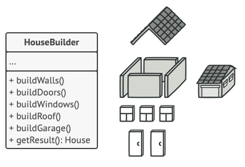

# The Builder Design Pattern

## 🔥 Why Builder Pattern is Needed
The Builder Pattern is essential for managing the construction of complex objects in a controlled, readable, and scalable way. In professional-grade systems, object creation often involves:
- **Multiple Optional Parameters**: Handling "Telescoping Constructors" where arguments become unmanageable.

- **Conditional Logic & Validation**: Ensuring an object isn't just "created," but "valid" before use.

- **Decoupling Construction from Representation**: Allowing the same construction process to create different products.

## 🎯 Core Problems It Solves
1. Constructor Overload & Readability
 - Eliminates long, confusing parameter lists.
 - Avoids "Boolean Hell" (e.g., new User(true, false, true, false)).

2. Encapsulation of Construction Logic
 - Keeps domain models "lean" by moving assembly logic to a dedicated Builder.
 - Prevents duplication of complex setup across the codebase.

3. Ensuring Invariants (Object Safety)
- Centralizes validation in the .build() step, ensuring objects never exist in an "incomplete" or "illegal" state.

## 🚀 Senior-Level Use Cases & Advanced Scenarios
- ✅ **Immutable Data Structures**: Perfect for functional programming where you build an object once and treat it as a constant thereafter.

- ✅ **Type-Safe Fluent APIs**: Using TypeScript to enforce that methodB() can only be called after methodA().

- ✅ **Test Data Builders**: Creating specific "Personas" for unit tests (e.g., UserBuilder.asAdmin().withExpiredSubscription().build()).

- ✅ **Complex UI Configurations**: Building high-level component props for charts, tables, or complex dashboards.

## 🏛️ The "Senior" Extension: Director vs. Builder
A common gap in intermediate knowledge is the Director.
- **The Builder**: Knows how to build the parts (e.g., `addHeader`, `addBody`).
- **The Director**: Knows the *recipe* (e.g., buildStandardReport).

**Insight**: By using a Director, you can encapsulate specific "pre-sets" of a complex object, further hiding complexity from the client.

## ⚖️ Trade-offs & Engineering Decisions
- ❌ **Indirection Overhead**: It adds more classes and interfaces. If your object only has 2-3 fields, a simple object literal is better.

- ❌ **Maintenance Coupling**: While it helps readability, the Builder must stay in sync with the Product's interface.

- ❌ **Mental Model Shift**: Developers must remember to call .build(). In some environments, forgetting this leads to "Incomplete Object" bugs.

## 🧠 Senior-Level Insight: When to Skip the Builder
In modern Frontend development (especially with TypeScript/React), we often favor **Object Literals with Interface Definitions for simple data.**

- **Decision Rule**: Use the Builder Pattern when the **order of construction matters**, when there are **strict validation rules**, or when you need to **abstract away the underlying class** from the consumer.

Reference: https://refactoring.guru/design-patterns/builder
